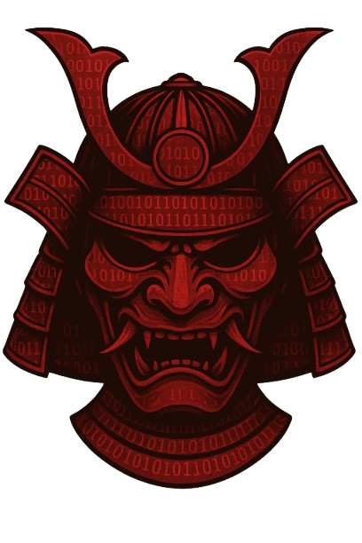

# SEmuRAI — Software Emulation & Reversing AI Framework


## About SEmuRAI
### Overview
**SEmuRAI** is a framework that gives LLMs the ability to perform both static and dynamic analysis, allowing them to play the role of a reverse engineering agent. SEmuRAI integrates various existing as well as custom components and provides a **CLI** from which analysts can work hand in hand with the agent to perform the analysis.

SEmuRAI was built with modularity in mind, and as such it is highly customisable for individual use cases. For more information, check out the section on **custom use cases** for more information.

### Key features
- CLI tool that facilitates interaction between analyst and agent.
- Custom MCP server that provides sandboxed debugger capabilities to LLMs by emulation of binary using the [Qiling framework](https://github.com/qilingframework/qiling).

## Usage
### Installation
*Note: As this project is still under development, installation at this stage can be tricky.*
1. Clone this repository
2. Set up required external dependencies:
    - [Ghidra](https://github.com/NationalSecurityAgency/ghidra)
    - [Ghidra Bridge](https://github.com/justfoxing/ghidra_bridge)
    - [GhidraMCP](https://github.com/LaurieWired/GhidraMCP)
3. Install Python dependencies and set up environment variables. The `setup.py` script is provided for your convenience.

### Using the CLI
1. Before CLI usage, ensure the following are set up:
    - Binary of interest has been loaded and opened in Ghidra's code browser
    - Ghidra Bridge script has been started
    - GhidraMCP plugin is enabled
2. Start the CLI by running the `Cli.py`.
3. Complete the necessary setup steps, as prompted by the CLI.
4. After the initial context setting, you will enter a chat loop with the LLM. You can converse with the agent, giving it additional directions and clarifications, or asking for conclusions. To quit, simply type `q` or `quit` into the prompt.

### Custom use cases
There are several (other) ways in which you can use SEmuRAI:
1. Using the SEmuRAI Emulation MCP server as a standalone MCP Server
    - To do so, simply set the path to point to `SemuraiMCPServer.py`. 
    - An example snippet for Claude Desktop (to be added to `claude_desktop_config.json`) is shown below:
    ```json
    {
        "mcpServers": {
            "SEmuRAI": {
            "command": "python",
            "args": [
                "/absolute/path/to/SEmuRAI/Backend/SemuraiMCPServer.py"
                ]
            }
        }
    }
    ```
2. Modifying LLM/prompts used
    - As long as your LLM API is OpenAI compatible, you can simply edit the `.env` file or use the `setup.py` script to set your API key, base url (base endpoint) and model name. This means that SEmuRAI can be used with both locally hosted as well as commercial LLM APIs.
    - Prompts used to set context can be found under the prompts folder. You may edit the contents of each text file but do not change the filenames.

## Additional notes
### Troubleshooting tips
- On certain systems, the `--break-system-packages` flag needs to be included when using `setup.py`. This flag results in the following command being run: `pip install -r requirements.txt --break-system-packages`.
- If there are any package conflicts, manual installation and deconflicting will need to be done. 

## License
SEmuRAI is released under the MIT License. See the [LICENSE](LICENSE) file for details.